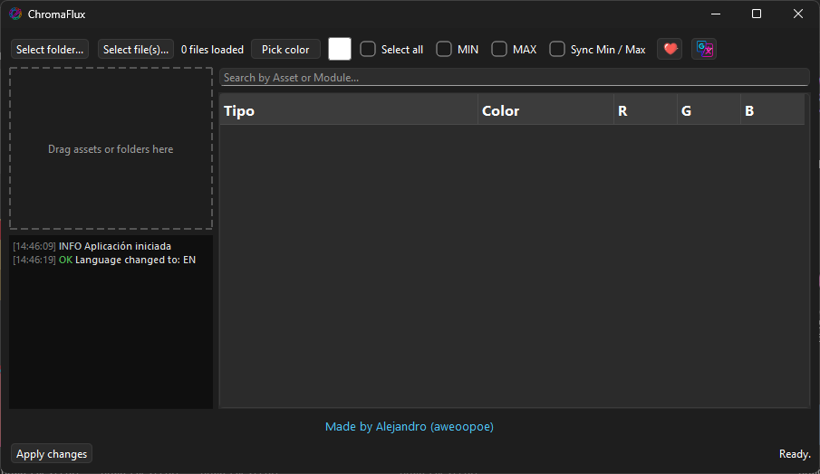

# **ChromaFlux 🎨**

ChromaFlux is a desktop tool designed to make editing Color and ColorOverLife

modules inside Unreal Engine .uasset files fast, visual and painless.

The project is still evolving,
so if you encounter any issues or have ideas to improve it, feel free to share.
Contributions and feedback are always welcome.


## 🖼️ Interface Preview

<p align="Alright">
  
</p>


## 🧭 Steps to use the app

- **1-** Open **ChromaFlux**
- **2-** Load your assets using one of the following methods:
  - `Select folder` (recursive scan)
  - `Select file(s)`
  - Drag & drop files or folders into the drop zone
- **3-** Wait for the assets to be processed and loaded into the tree view
- **4-** Browse the tree structure:
  - Asset → Module → **MIN / MAX**
- **5-** Select rows manually or use the quick filters:
  - `Select all`
  - `MIN`
  - `MAX`
- **6-** (Optional) Enable **Sync Min / Max** if you want both values to match
- **7-** Click **Pick color** or double-click a color cell to open the color picker
- **8-** Preview the selected color instantly in the tree and the color box
- **9-** When you are done, press **Apply changes**
- **10-** The app will rebuild the `.uasset` files with the new colors applied

---

## 🎯 Uses of the app

ChromaFlux can be used in many different ways depending on your workflow.

### Some examples:

- Quickly adjust particle colors without opening Unreal Editor
- Batch-edit MIN / MAX ColorOverLife values
- Fine-tune VFX colors for mods or prototypes
- Experiment visually with color variations
- Speed up iteration when working with large asset packs

The app is designed to save time and reduce friction when working with
ColorOverLife and Color modules, especially for modders and technical artists.```

---

## ⚠ Notes & Warnings

- This tool modifies `.uasset` files — **always keep backups**
- 
- If Windows flags the app or executable, it is a false positive caused by:
  - Python-based executables
  - Custom UI frameworks (Qt / PySide)
- The project is **virus-free**, but use it at your own discretion

> My goal is not to harm anyone, only to contribute a useful tool that makes
working with Unreal assets easier and faster.

---

## 🌍 Languages

- English
- Spanish

(Language can be changed from the settings button)

---

## ❤️ Support & Donations

If you find ChromaFlux useful and want to support its development,
you can donate here:

👉 **PayPal:**  
https://www.paypal.com/paypalme/Alejo07378

Any support is greatly appreciated and helps keep the project alive and improving.

---

## 🤝 Contributing

- Bug reports
- Feature ideas
- Code improvements
- UI/UX suggestions

All feedback is welcome. If you want to contribute, feel free to open an issue
or a pull request.

---

> Thank you for using ChromaFlux and for supporting independent tools for the
Unreal Engine community 💙
